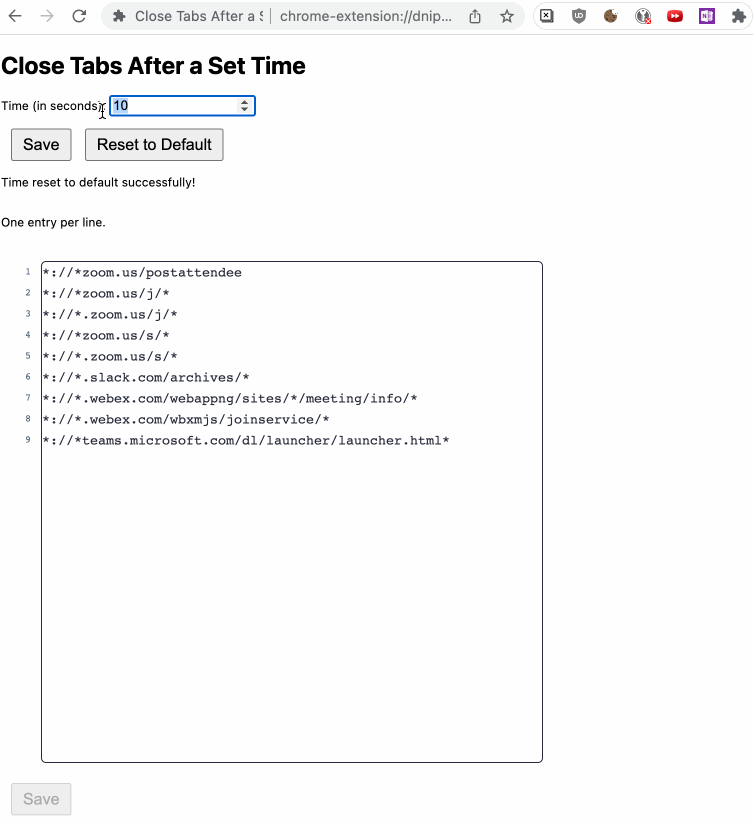

# Redirect Tab Closer

A Chrome extension that automatically closes the launched window for various redirect browser tabs opened by apps like Zoom, WebEx, Slack and Microsoft Teams.

## How to install from source

* Turn on developer mode first if you haven't (Check instruction below if you don't know how to)
* Download the latest version from this repository and unzip it
* Open Chrome Extension Manager: `chrome://extensions/`
* Click `Load unpacked`, and select the unzipped folder

## Turn on developer mode

* Open Chrome Extension Manager: `chrome://extensions/`
* Click developer mode switch (on top right corner of the screen) to on
* You will see `Load unpacked` on the toolbar if you succeeded

---

Loosely based on the [redirect-tab-closer](https://github.com/github-throwaway/redirect-tab-closer) extension, which is based on the [bluejeans-zoom-closer](https://github.com/edgar/bluejeans-zoom-closer) extension, which was in turn based on the [zoom-close](https://github.com/seanstar12/zoom-close) extension.
